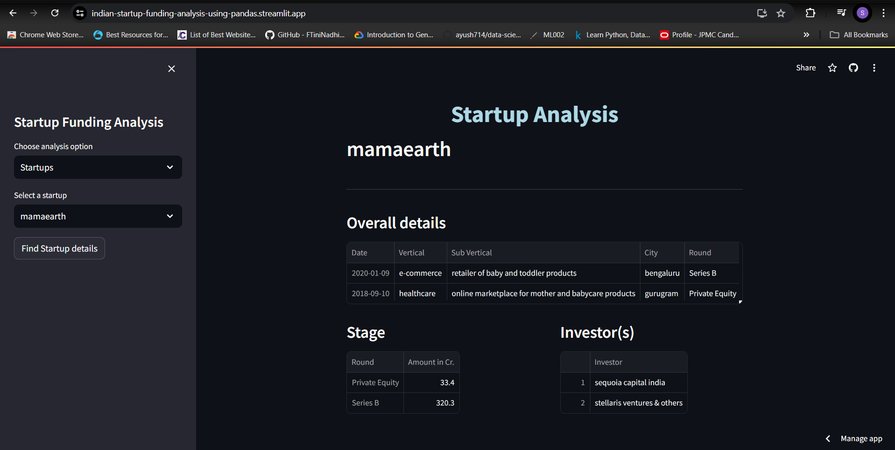
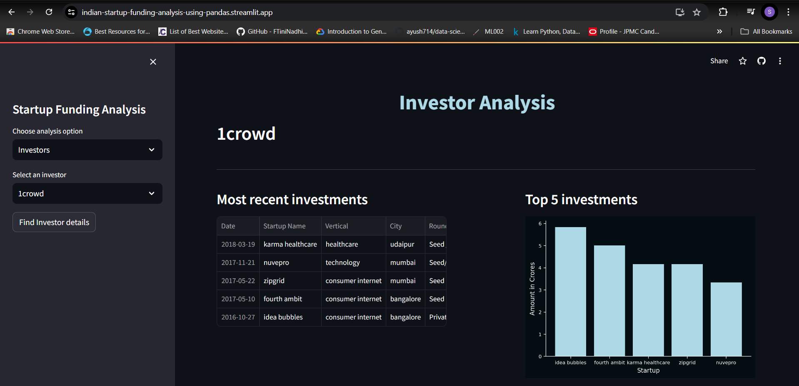

# Indian Startup Funding Data Visualization

🚀 **Discover the Thriving Indian Startup Ecosystem with Data Visualization!** 🌟

## Project Overview
The **Indian Startup Funding Data Visualization** project is a web-based application that allows you to explore the Indian startup funding dataset in a visually engaging and informative way. Developed using the powerful Streamlit framework, this project leverages the Pandas and Plotly libraries to deliver a seamless user experience.

### Objectives
- Perform an overall analysis of the startup funding ecosystem in India.
- Enable detailed analysis of individual startups.
- Provide insights into individual investors.

## Table of Contents
- [Project Overview](#project-overview)
- [Installation](#installation)
- [Dataset](#dataset)
- [Website Structure](#website-structure)
  - [Section 1: Overall Analysis](#section-1-overall-analysis)
  - [Section 2: Startup Analysis](#section-2-startup-analysis)
  - [Section 3: Investor Analysis](#section-3-investor-analysis)
- [How to Use](#how-to-use)
- [Contributing](#contributing)
- [Contact](#contact)

## Installation

Getting started with the Indian Startup Funding Data Visualization project is a breeze. Follow these simple steps to set it up on your local machine:

```sh
# Clone the GitHub repository
git clone https://github.com/shrutibharat01/Indian_Startup_Analysis_StreamlitApp.git

# Navigate to the project directory
cd Indian_Startup_Analysis_StreamlitApp

# Install the required dependencies
pip install -r requirements.txt

# Run the Streamlit app
streamlit run tester.py

```

## Dataset

The dataset used in this project contains a wealth of information about Indian startup funding, including details about the startups, investors, funding amounts, sectors, and more. You can find the dataset at the following Kaggle link: [Indian Startup Funding Dataset](https://www.kaggle.com/sudalairajkumar/indian-startup-funding).

Make sure to download the dataset and place it in the appropriate directory within the project structure.

## Website Structure

The Indian Startup Funding Data Visualization project features three main sections, each offering a unique perspective on the startup funding ecosystem:


### Section 1: Overall Analysis
This section provides an overarching view of the Indian startup funding landscape. Dive into the following captivating components:

- **📈 Month by Month Analysis:** Explore key metrics such as total investments, maximum investment, average investment, and total funded startups.
- **📊 Month-on-Month Line Graphs:** Visualize the trends in total funding and total funded startups over time.
- **📈 Total Funded Indian Startups:** Witness the growth in the number of funded Indian startups month-on-month.
- **🏆 Top 5 Most Funded Sectors:** Discover the sectors that have received the highest funding amounts.
- **🏆 Top 10 Most Funded Startups:** Uncover the startups that have secured the most funding over the years.
- **🏆 Top Investors:** Identify the investors who have made the largest investments.


### Section 2: Startup Analysis
In this section, you can delve into the details of individual startups. Simply select a startup from the dropdown menu and explore:

- **📊 Selected Startup Information:** Dive into the key metrics of the chosen startup, including total investments, sector, subsector, funding stage, and investors.
- **🔍 Similar Startups:** Discover other startups that operate in the same sector as the selected one.



### Section 3: Investor Analysis
Shift your focus to the investors shaping the Indian startup ecosystem. In this section, you can select a specific investor and uncover:

- **📊 Selected Investor Information:** Gain insights into the chosen investor’s investment activities, including the startups they’ve funded, the cities they’ve invested in, and the sectors they’ve focused on.
- **🏆 Biggest Investments:** Identify the largest investments made by the selected investor.
- **📊 Most Invested City, Sector, Subsector, and Investment Type:** Explore the areas where the investor has been most active.
- **📈 YoY Investment:** Analyze the investor’s year-on-year investment trends.
- **🔍 Investors in Similar Sectors:** Discover other investors who have funded startups in the same sectors as the selected investor.



## How to Use

Ready to dive into the Indian startup funding landscape? Here’s how you can get started:

1. 🚀 Launch the Streamlit app by following the installation instructions.
2. 🌐 Access the provided URL in your web browser to load the website.
3. 🔍 Explore the different sections and visualizations to gain insights into the Indian startup funding ecosystem.
4. 🔍 Use the dropdown menus to select specific startups or investors and uncover detailed information about them.
5. 🤯 Immerse yourself in the interactive visualizations and uncover the trends, patterns, and insights that shape the Indian startup funding landscape.

## Contributing

Contributions to this project are warmly welcomed! If you have any ideas, improvements, or bug fixes, feel free to submit a Pull Request. Let’s work together to enhance the Indian Startup Funding Data Visualization project and make it even more valuable for the community.

## Contact

For any questions or inquiries, don’t hesitate to reach out to me on LinkedIn:

- LinkedIn — [Shruti Bharat](https://www.linkedin.com/in/shrutibharat)

Let’s dive into the fascinating world of Indian startup funding and uncover the insights that will inspire and empower entrepreneurs, investors, and enthusiasts alike. 🌟✨
